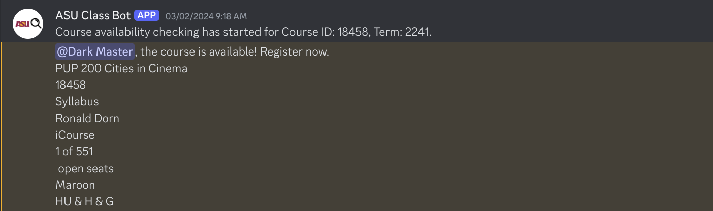

## Introduction: What is this?

Hello, and welcome to this corner of the internet. This website is mainly to share the work that I have done, along with concepts and projects that I have worked on.

This is the first blog that I will share here, I have used Astro and Tailwind CSS for the design of this website and some components of [Nicdun's Astro Blog Template](https://github.com/nicdun/astro-tech-blog/tree/main).

The objective of this blog is to explain the project ASU Class Scraper, where I managed to solve the problem of getting classes, especially when they are full.

## Problem Statement

Every semester, Almost Every Student I know has had to wake up at 6:00 AM to get the Classes that they need, and even if you wake up early it does not guarantee getting the class. Classes fill up quickly, and many students have to delay their academic progress

This problem does not apply if you are part of Barrett though. The honors college has early registration (A friend of mine was very gleeful about not having to deal with a lack of class space).

## The Approach

The initial solution was fairly straightforward: create a tool that could monitor the ASU Class Search website and alert students when a class they are interested in has an available seat. 

I started with a Python script using Selenium for web scraping, a method that allowed me to automate interaction with the website as if I were browsing manually.

The code snippet for loading the getting the website:

```python
from selenium import webdriver
from selenium.webdriver.chrome.options import Options

chrome_options = Options()
chrome_options.add_argument("--headless")
driver = webdriver.Chrome(options=chrome_options)
driver.get("https://catalog.apps.asu.edu/catalog/classes")
```

This was a fairly intuitive idea and was an obvious solution (Which is still used in my current Discord Bot), however this method, while functional, was not without its challenges, such as handling the dynamic nature of web pages and the issue of multiple requests, which persists.

## Utilization of API

Another approach that I learned of while working on this project and having discussions with other students who were also interested in this solution was a friend of mine [Deej Cabral](https://github.com/DeejC04) pointed me to the existence of the API that is used by ASU for track classes

I won't go into too much detail regarding the API but eventually ended up realizing that the API did not always give the correct number of classes open, which posed an issue, and ended up reverting to the initial selenium scraper.

Basic API Usage:
```python
import requests
import json

headers = {'Authorization': 'Bearer your_token'}
response = requests.get("https://eadvs-cscc-catalog-api.apps.asu.edu/catalog-microservices/api/v1/search/classes", headers=headers)
data = json.loads(response.text)
```

To make this tool more accessible, I integrated it into a Discord bot, allowing students to interact with the scraper in real time through a familiar platform. 



This allowed for people to be able to use this code to get classes that they needed.

## Conclusion 

The project was not only about solving a practical problem but also a tremendous learning opportunity in handling real-time data, and an introduction to Web Scraping.

This is one of the first projects I did at ASU as a freshman and ended up refining and working on it till my sophomore year. 

I'm eager to see how this project will end up, and I welcome any feedback or contributions. If you are interested in further details of this project or wish to use it, feel free to check the project out [Github Link](https://github.com/KunjVPatel/ASU-Class-Searcher/tree/main)

## Summary

In the inaugural post of this Portfolio website, I introduce the ASU Class Scraper Project, a tool that is used to secure classes after they fill up. This project began as a Python-based Selenium scraper to monitor class openings in real time and evolved to incorporate API usage, although it reverted to Selenium due to API limitations. The final project ended up as a Discord bot.

---
Thank you for reading and look forward to further updates.